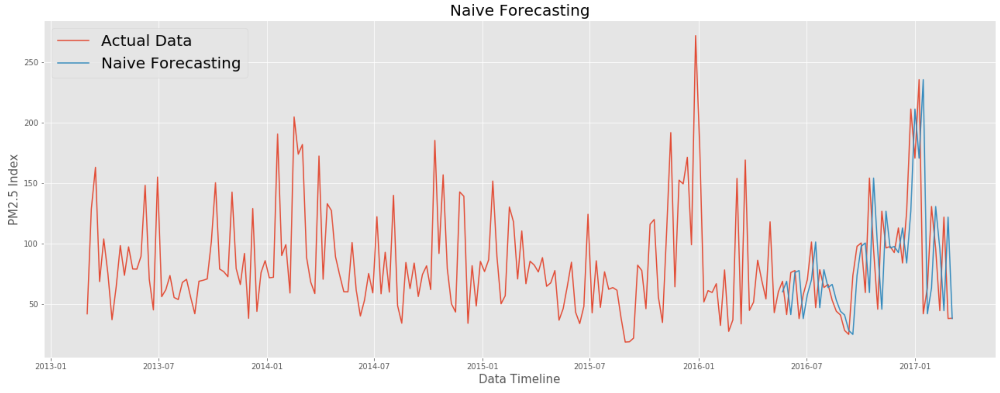
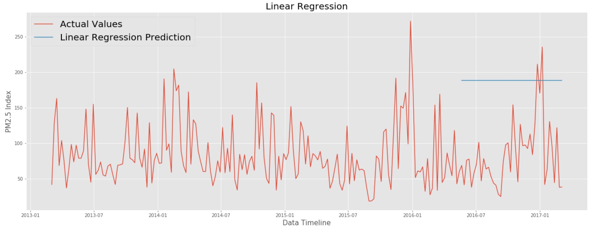

# Air Pollution Time Series
## Capstone Project

**Authors**: Andy Peng

The contents of this repository detail an analysis of the Capstone project. This analysis is detailed in hopes of making the work accessible and replicable.


### Business problem:

A company has tasked us to investigate the air quality in Gucheng area in China.  Our goal is to create a model that can predict the air pollution quality in Gucheng.


### Data
Our dataset comes from [UCI](https://archive.ics.uci.edu/ml/datasets/Beijing+Multi-Site+Air-Quality+Data). The dataset contains hourly air pollutants data from 12 nationally-controlled air quality monitoring sites. We will mainly focus on the PM2.5 index values from Gucheng monitoring site. Therefore the csv file provided above contains hourly air pollutants data from March 01, 2013 to February 28, 2017 from Gucheng's monitoring site.


## Methods
- Descriptive Analysis
- Modeling
- Choices made
- Key relevant findings from exploritory data analysis

## Results


#### Visual 1

> PM2.5 Cutoff Levels

#### Visual 2

> PM2.5 Scale Levels Graph

#### Visual 3

> Effects of Holiday on PM2.5 levels

#### Models

> Naive Forecasting Predictions


> Linear Regression Predictions


> SARIMA Model Predictions


> Modeling Results


## Recommendations:

To summarize everything above, we explored public holidays and its relationship to Gucheng's PM2.5 levels.

We concluded that there seems to be slight increase during and after the New Year holiday. The other public holidays had no pattern that stood out in our visualizations. However, there are things we can further explore given more time such as holidays that are specific to Gucheng region.

After that we explored the stationary patterns in our data and found that there was slight stationary in our weekly data.

Finally we did modeling on our data. Below are the three model's results.

* Naive Forecasting Model - RMSE = 51.64

* Linear Regression Model - RMSE = 113.71

* SARIMA Model - RMSE = 56.67

As you can see the best model that we have is Naive Forecasting Model.

## Limitations & Next Steps

There are many things that we didn't due to lack of time and money constraints. For example, there might be some holidays that only take place in Gucheng. We could also explore day versuses night PM2.5 levels because there might be more cars driving in the morning compare to night. There are huge spikes in our data, we could research if there are any events that happen in Gucheng that led to these huge spikes. For modeling, we could also use cross validation, neural networks or gather more data to further improve our models. However, all these require extra time and money.


### For further information
Please review the narrative of our analysis in [our jupyter notebook](./Capstone_Project.ipynb) or review our [presentation](./Capstone_Presentation.pdf)

For any additional questions, please contact **andypeng93@gmail.com)


##### Repository Structure:

Here is where you would describe the structure of your repoistory and its contents, for example:

```

├── README.md                       <- The top-level README for reviewers of this project.
├── Capstone_Porject.ipynb             <- narrative documentation of analysis in jupyter notebook
├── presentation.pdf                <- pdf version of project presentation
└── Visualization
    └── images                          <- both sourced externally and generated from code

```
